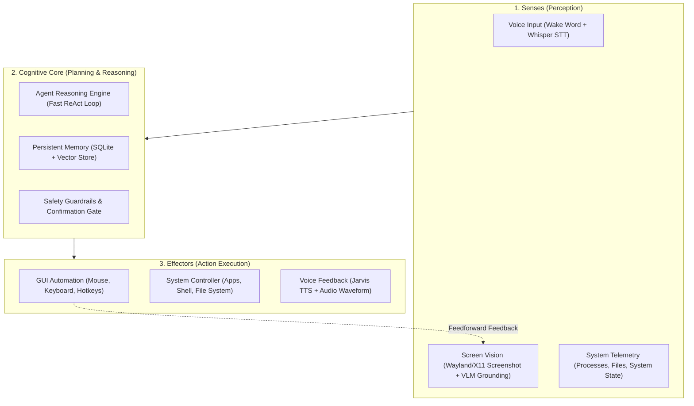

# Project J.A.R.V.I.S.
> **Just A Rather Very Intelligent System**  
> An autonomous desktop AI agent designed to interact with your operating system like a human: observing screens, controlling cursor and keyboard, managing applications, executing commands, and communicating with natural voice.
e
---

## 🧭 Project Vision & Architecture

The objective of this project is to build an autonomous desktop companion inspired by Iron Man's J.A.R.V.I.S. Rather than just a chatbot, this system integrates:



---

## 🛠️ Step-by-Step Implementation Roadmap

This project is broken down into structured, testable milestones so each capability is verified before advancing to the next.

### Phase 1: Cognitive Engine & Agent Loop (The "Brain")
- [x] **Step 1.1 — Environment & Project Scaffolding**
  - Set up Python virtual environment (`venv`) and package dependencies (`pydantic`, `openai`, `anthropic`, `python-dotenv`, `loguru`).
  - Create modular directory architecture (`core/`, `tools/`, `vision/`, `voice/`, `memory/`).
- [x] **Step 1.2 — ReAct Agent Loop & Structured Tool Calling**
  - Implement a ReAct (Reason + Act) loop supporting tool invocation, argument validation, and structured error handling.
  - Support hybrid model backends (Groq for ultra-low latency, Claude/Gemini/GPT-4o for complex reasoning).
- [x] **Step 1.3 — Interactive Terminal Testbed**
  - Build a CLI chat harness to test tools, reasoning chains, and output formatting.

---

### Phase 2: System & Workspace Control (The "Hands - Level 1")
- [x] **Step 2.1 — Application Management**
  - Launch, focus, and terminate applications cleanly on Linux (`xdg-open`, `gio`, `wmctrl`, `xdotool`, and native Hyprland `hyprctl`).
  - Read active windows and running processes (`psutil`).
- [x] **Step 2.2 — File System & Workspace Automation**
  - Safe file operations: read, search (grep/glob), create, edit, rename, and trash.
  - Diff preview generation before modifying critical files.
- [x] **Step 2.3 — System Hardware & Environment Controls**
  - Audio volume management, screen brightness, battery/CPU telemetry, network status, and desktop notifications (`notify-send`).
- [x] **Step 2.4 — Safety & Confirmation Guardrails**
  - Define risk tiers: Auto-allowed (read-only, volume, app launch) vs User-confirmation required (file deletion, terminal execution, sensitive system changes).

---

### Phase 3: Screen Perception & Vision (The "Eyes")
- [x] **Step 3.1 — Low-Latency Screen Capture**
  - Native Linux capture pipeline compatible with Wayland & X11 (`grim`, `mss`, or PipeWire desktop portal).
  - Multi-monitor support and window-specific capture.
- [x] **Step 3.2 — Visual Element Grounding (VLM Coordinate Mapping)**
  - Integrate Vision-Language Models (VLM) to analyze screenshot images and predict normalized target coordinates `(x, y)` for UI elements (buttons, inputs, menus, links).
  - Optimize payload size via dynamic downscaling, regional cropping, and OCR preprocessing (`pytesseract` / EasyOCR).
- [x] **Step 3.3 — Screen Change Detection (Visual Diffing)**
  - Compare consecutive frames to detect UI state changes and confirm that an action succeeded.

---

### Phase 4: GUI Automation & Desktop "Computer Use" (The "Hands - Level 2")
- [x] **Step 4.1 — Mouse & Keyboard Emulation**
  - Wayland/X11 input automation (`pyautogui`, `pynput`, or `ydotool` for native Wayland).
  - Actions: smooth move, left/right/double click, click-and-drag, text typing, and complex key combinations (e.g., `Ctrl+Alt+T`, `Super+D`).
- [x] **Step 4.2 — Closed-Loop Action Verification**
  - The core "Human-Like" loop:
    1. **Observe**: Capture screen.
    2. **Decide**: Locate target element coordinates.
    3. **Act**: Move cursor and click/type.
    4. **Verify**: Capture new frame to verify the UI updated as expected.
    5. **Recover**: If target wasn't reached, retry with adjusted coordinates or alternative shortcut.

---

### Phase 5: Voice Interface & Jarvis Persona (The "Voice")
- [x] **Step 5.1 — Wake-Word Engine**
  - Continuous local listening for activation keyword ("Jarvis" / "Hey Jarvis") with zero cloud latency.
- [x] **Step 5.2 — High-Speed Speech-to-Text (STT)**
  - Fast transcription via Groq Whisper Large v3 Turbo (<300ms latency) and PipeWire microphone recording.
- [x] **Step 5.3 — Jarvis Text-to-Speech (TTS) Engine**
  - Crisp British speech synthesis (EdgeTTS British English male voice `en-GB-RyanNeural`).
  - Streaming audio playback so Jarvis begins answering immediately.
- [x] **Step 5.4 — Barge-In / Interruption Handling**
  - Instant speech cancellation and barge-in cut-off.

---

### Phase 6: Memory, Personalization & Workspace Context
- [ ] **Step 6.1 — Short-Term Working Memory & History**
  - Sliding conversation history and action scratchpad for complex multi-turn tasks.
- [ ] **Step 6.2 — Long-Term Episodic Memory**
  - Local vector database (SQLite + ChromaDB / LanceDB) to store user preferences, frequently used apps, project paths, and past conversations.
- [ ] **Step 6.3 — User Preference Profiles**
  - Personality fine-tuning: refined, polite, witty, highly efficient tone matching Iron Man's Jarvis.

---

### Phase 7: Tony Stark HUD & Desktop Overlay (The "Interface")
- [ ] **Step 7.1 — Floating Desktop HUD**
  - Lightweight, transparent desktop overlay (PyQt6 / Webview) in a sci-fi minimalist aesthetic.
  - States: *Standby*, *Listening*, *Processing*, *Executing Action*, *Speaking*.
- [ ] **Step 7.2 — Audio Visualizer Waveform**
  - Real-time animated audio ring or arc reactor waveform synced to microphone input and TTS output.
- [ ] **Step 7.3 — Visual Action Indicator**
  - Subtle highlight or cursor ping showing where Jarvis is about to click on the screen.

---

### Phase 8: Autonomous Multi-Step Workflows
- [ ] **Step 8.1 — Complex Multi-Step Task Planning**
  - Breaking high-level commands into sequential sub-goals (e.g., *"Open VS Code, create a Python script for weather forecast, run it, and show me the output"*).
- [ ] **Step 8.2 — Self-Correction & Fallbacks**
  - Detecting errors, reading terminal output / dialog popups, and autonomously trying alternative solutions.

---

## 📂 Proposed Project Directory Structure

```text
AGI/
├── README.md                  # Project master roadmap & documentation
├── .env                       # API keys and environment variables
├── .gitignore                 # Git ignore rules
├── requirements.txt           # Python dependencies
├── config.yaml                # Jarvis configuration (voice, models, thresholds)
│
├── core/                      # Cognitive core & orchestrator
│   ├── __init__.py
│   ├── agent.py               # Main ReAct loop & state machine
│   ├── planner.py             # Multi-step goal decomposition
│   └── prompts.py             # Jarvis system prompts and persona
│
├── tools/                     # System interaction tools
│   ├── __init__.py
│   ├── app_control.py         # Launch and focus applications
│   ├── file_ops.py            # Read/write/edit/search files
│   ├── system_ctl.py          # Volume, brightness, notifications, power
│   └── shell_runner.py        # Safe bash execution with confirmation
│
├── vision/                    # Screen perception & visual grounding
│   ├── __init__.py
│   ├── capture.py             # Wayland/X11 screen capture
│   ├── grounding.py           # VLM visual coordinate detection
│   └── visual_diff.py         # Action verification via frame diffs
│
├── gui_driver/                # Desktop computer use
│   ├── __init__.py
│   ├── mouse_keyboard.py      # Input simulation (PyAutoGUI / ydotool)
│   └── navigator.py           # Closed-loop screen navigator
│
├── voice/                     # Voice input & output subsystem
│   ├── __init__.py
│   ├── wake_word.py           # OpenWakeWord detector
│   ├── listener.py            # Silero VAD + Whisper STT
│   └── speaker.py             # Streaming Edge-TTS / ElevenLabs playback
│
├── memory/                    # Persistent storage & context
│   ├── __init__.py
│   ├── store.py               # Vector DB & SQLite memory
│   └── context_manager.py     # Sliding window context
│
└── ui/                        # Optional HUD & Visualizer
    ├── __init__.py
    └── overlay.py             # Transparent desktop status widget
```

---

## 🚀 Getting Started

Follow the roadmap step-by-step starting from **Phase 1: Step 1.1**.
